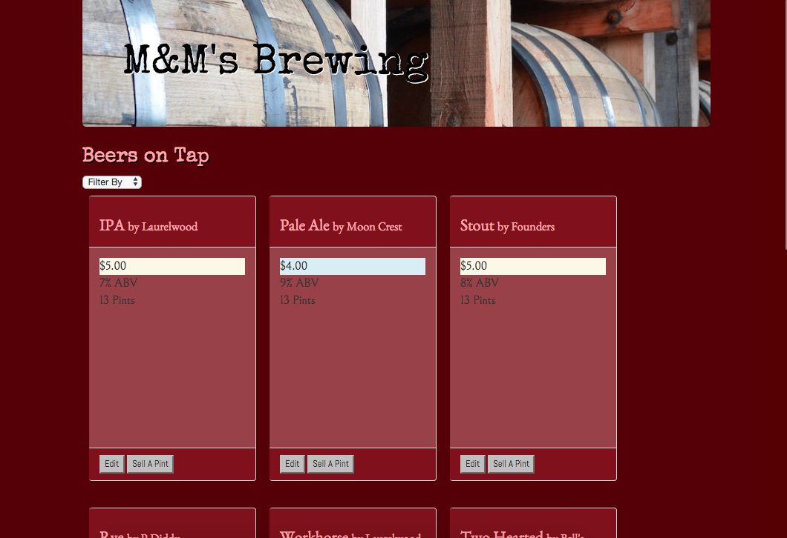
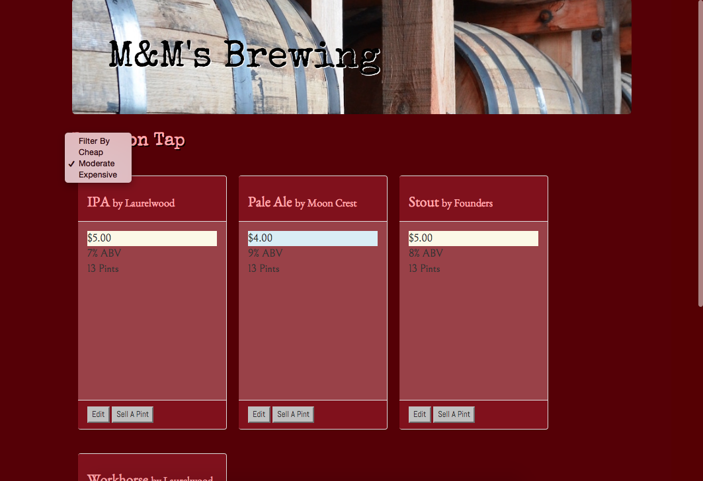
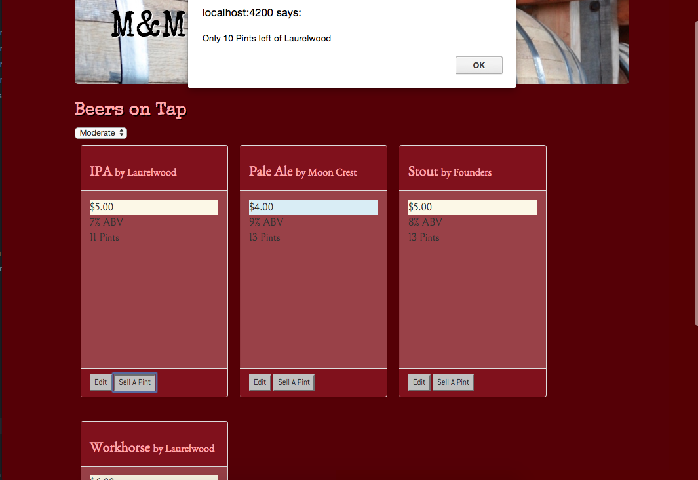

# Taproom
### Angular in class project 8.17.17
By Michelle Poterek and Max Scher

## Description
_This is a program written using Angular CLI with focus on two-way data binding, displaying dynamic data, nesting components, and filtering data with a pipe._

## User Story
* As a patron, I want to see a list/menu of all available kegs. For each keg, I need to see its name, brand, price and alcoholContent (or perhaps something like flavor for a kombucha store).
* As an employee, I want to fill out a form when I tap a new keg to add it to the list. (Don't worry about authenticating employee user accounts yet.)
* As an employee, I want the option to edit a keg's properties after entering them just in case I make a mistake.
* As a patron and/or employee, I want to see how many pints are left in a keg.
* As an employee, I want to be able to click a button next to a keg whenever I sell a pint of it. This should decrease the number of pints left by 1.
* As an employee, I want to be able to see kegs with less than 10 pints left so I can be ready to change them.
* As a patron, I want to have kegs prices to be color-coded for easy readability. Perhaps based on their price (greater or less than $5 per pint, perhaps) or the particular style of beer or kombucha.
* As a patron, I want to use the alcohol content property to display stronger beers differently than weaker beers.

## Application Screenshots
_Applicaion Homepage_

_Application filtering by price_

_Application has ability to show how many pints are left and alerts user once the amount in the keg reaches an estimated 10 pints left_

## Installation
In Terminal,
* `git clone https://github.com/PoterekM/angular-tap-room`
* `cd angular-tap-room`
* `npm install`
* `bower install`
* `ng serve`
In Browser,
* Visit the app at http://localhost:4200.

## License Information
This web application is free to use under the MIT License &copy; Michelle Poterek and Max Scher

# Additional Developer Information

## Code scaffolding

Run `ng generate component component-name` to generate a new component. You can also use `ng generate directive/pipe/service/class/module`.

## Build

Run `ng build` to build the project. The build artifacts will be stored in the `dist/` directory. Use the `-prod` flag for a production build.

## Running unit tests

Run `ng test` to execute the unit tests via [Karma](https://karma-runner.github.io).

## Running end-to-end tests

Run `ng e2e` to execute the end-to-end tests via [Protractor](http://www.protractortest.org/).
Before running the tests make sure you are serving the app via `ng serve`.

## Further help

To get more help on the Angular CLI use `ng help` or go check out the [Angular CLI README](https://github.com/angular/angular-cli/blob/master/README.md).
